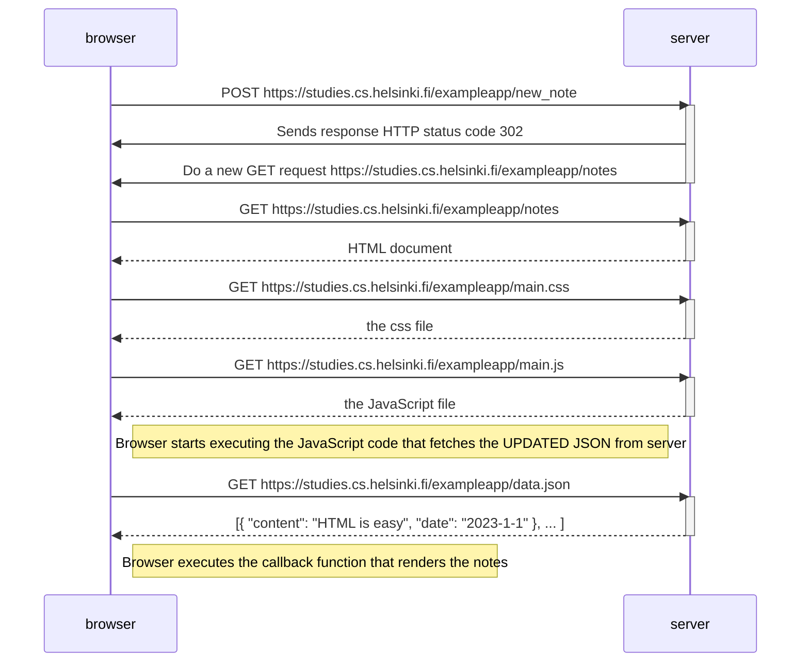

# Sequence Diagram

```
Sequence Diagram 
Exercise 04 of Part 00 of Full Stack Open Course by University of Helskini. 

Function:
Depicts the situation where user creates a new note on the page https://studies.cs.helsinki.fi/exampleapp/notes.

1. Writes something into the text field 
2. Clicks the submit button.

```


