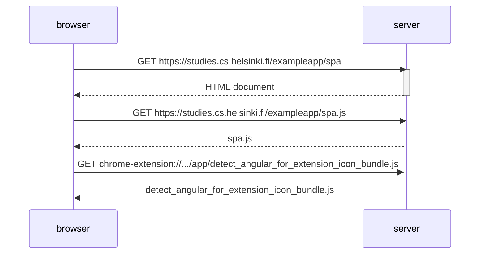

# Sequence Diagram

```
Sequence Diagram 
Exercise 05 of Part 00 of Full Stack Open Course by University of Helskini. 

Function:
Depicts the situation where user goes to the single-page app version of the notes app at https://studies.cs.helsinki.fi/exampleapp/spa.

```


