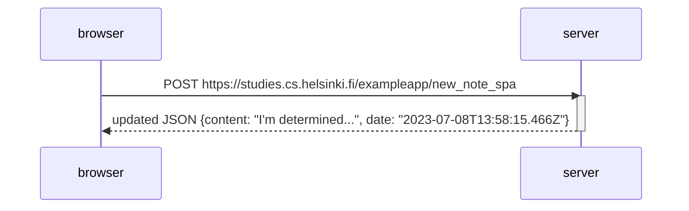

# Sequence Diagram

```
Sequence Diagram 
Exercise 06 of Part 00 of Full Stack Open Course by University of Helskini. 

Function:
Depicts the situation where user creates a new note using the single-page version of the app.

```


